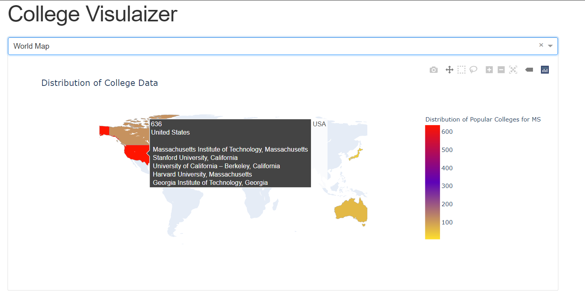
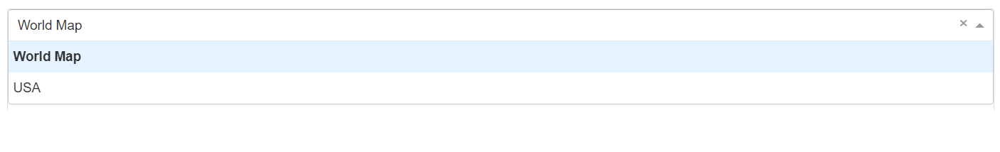
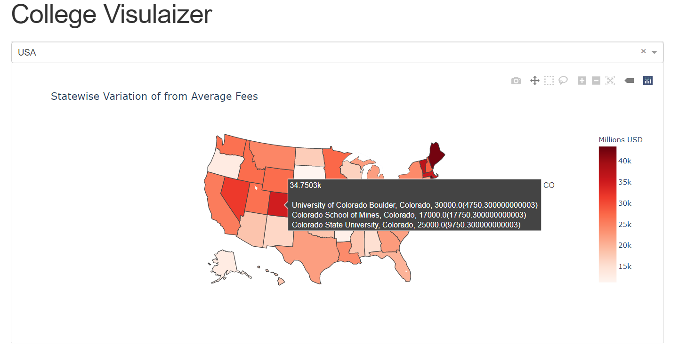
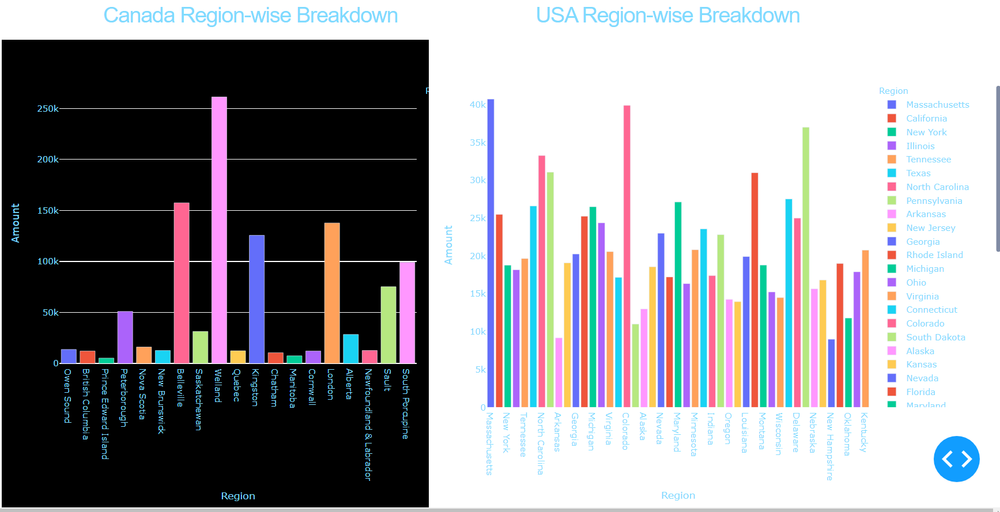

# MSFeeDashboard : Post Graduate college fees visualiser
##This is a dashboard based on Python’s framework Dash and Plotly. We have scraped college data for post graduate studies from the web using the Requests library from public websites like Yocket.in. The data is manoipulated using the Pandas library.
The first plot is a choropleth map showing the distribution of colleges in the dataset. Hovering over a country reveals its most popular colleges and the total count.

A drop down menu allows you to view by country (currently only USA has been supported)

The second map is a heatmap showing deviation from the average fee in that country. Hovering over each state shows the top 5 universities and its deviation from the average.

The two bar graphs are made on the basis of average fees in each of the prominent locations in the United States and Canada.Colleges were sorted out on the basis of their location(both public and private institutions) and average was calculated for each of the same. 

##Master Branch Files
###YocketAJAX.py
Simulates an AJAX request on yocket.in to keep getting universities. The three functions build "universities.xlsx", "universities2.xlsx" and "universities3.xlsx" respectively to show stage wise changes in data. 

###RegionWiseGrapher.py
Builds both bar graphs

###newdashapp.py
Comobined Dash app to display both choropleth and bar graphs

##MakAcp Branch Files
###Webscrape.py - This python file includes all the web scraping done in the project. This is done using the BeautifulSoup4 module and Selenium WebDriver(software testing tool). The data is put into the soup using BS4
